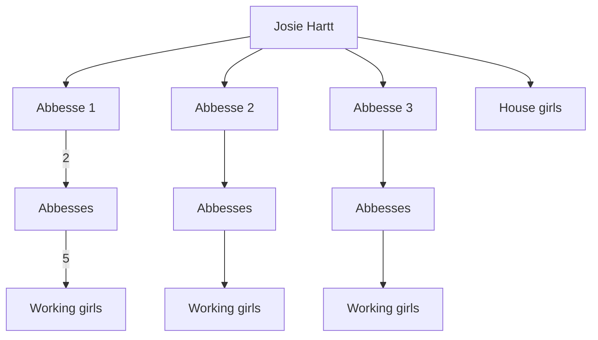

---
title: Abbesses
tags: notes
season: summer
toc: true
comments: true
---
---
alias: 'the hard house, Harrt house'
---

#faction #npc #delios 
# The Abbesses
A gang of women mostly have banded together to run prostetution.
It started with a simple whorehouse [[The Hart House]] and a "madam" [[Josie Harrt]] from [[Arendur]] on the western outskirts of [[Delios]] by the lake 4 years ago.

[[Josie Harrt]] found that business was good, especially with all the hired help on the ranches, so good in fact that a service of bringing girls out to the ranches began about 3 years ago. She brought in women to manage and oversee the girls, they got the name "Abbesses" from either the girls or customers, nobody really knows who started it but it stuck.

[[Josie Harrt]] started with 3 Abbesses, working girls she knew from her time in [[Arendur]], in fact they are part of a [[shady guild]] that makes it a business to provide what people desires, materials or creatures or people.

